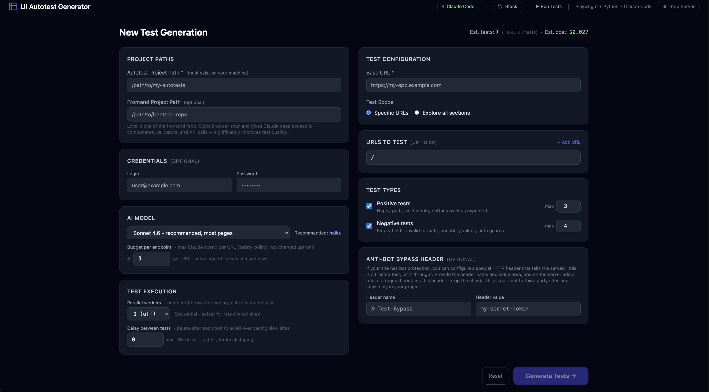

# UI Autotest Generator

A local web tool for automatically generating and validating UI tests with **Playwright + Python** using **Claude Code** as the AI engine.



---

## Quick start

**macOS / Linux:**
```bash
bash run.sh
```

**Windows:**
```bat
run.bat
```

The browser opens automatically after launch (usually `http://localhost:5001`).

---

## Platform notes

### macOS
- Requires Python 3.10+
- Virtual environment, dependencies, and Playwright Chromium browser are set up automatically
- Allure CLI is installed automatically via Homebrew if not found (`brew install allure`)
- Browser opens automatically
- Port 5000 is reserved by AirPlay Receiver — the script finds a free port starting from 5001
- To specify a port manually: `PORT=8080 bash run.sh`

### Linux (Ubuntu / Debian)
- Requires Python 3.10+: `sudo apt install python3`
- `python3-venv` is installed automatically if missing (requires `sudo`)
- If the project is on an NTFS/exFAT drive (no symlink support), the virtual environment is created in `~/.local/share/ui-autotests-venv` instead
- Playwright Chromium browser is installed automatically on every launch (fast if already installed)
- Allure CLI is downloaded automatically from GitHub releases to `~/.local/share/allure-2.27.0/` and linked at `~/.local/bin/allure` — requires Java (see below)
- Browser opens automatically via `xdg-open` (requires a desktop environment)
- **Java** is required for Allure reports: `sudo apt install default-jre`

### Windows
- Python is installed automatically if not found (via winget or direct download from python.org)
- Virtual environment and dependencies are set up automatically
- Playwright Chromium browser is installed automatically
- Java (for Allure) is installed automatically via winget (`Microsoft.OpenJDK.21`) or Scoop
- Allure CLI is installed automatically via Scoop
- Browser opens automatically
- Port is selected automatically starting from 5001

---

## What the tool does

1. Analyzes a frontend project (React, Vue, Angular, Next.js, Nuxt) and extracts routes, form fields, buttons, API calls — **or** scans pages in a live browser if frontend code is not provided
2. In **Explore** mode without a frontend path — crawls navigation links on the homepage to discover all sections automatically (up to 50 pages)
3. Checks existing tests in the autotest project — **does not duplicate** already covered cases
4. If a page has changed — **automatically detects uncovered features** and adds tests only for them
5. Generates positive and/or negative Playwright tests via Claude Code with a configurable limit per type
6. **Self-heals generated tests** — immediately runs each test file after generation; if tests fail, Claude fixes them (up to 2 attempts). Tests that cannot be fixed are marked **⚠ Review**
7. Runs all generated tests with support for **parallel execution** (pytest-xdist) and a configurable delay
8. Diagnoses flaky failures: classifies `FLAKY_TIMING`, `SELECTOR_ISSUE`, `APP_BUG`, `FLAKY_NETWORK`
9. Shows results grouped by endpoint with the ability to **delete, skip, or restore** individual tests
10. Generates an **Allure report** and opens it in the browser with one button
11. Creates `run_tests.sh` in the autotest project — a standalone script for running without the web app

---

## Requirements

| Component | Requirement |
|-----------|------------|
| Python | 3.10+ |
| Claude Code CLI | Installed and authenticated (`claude` available in PATH) |
| Autotest project | **Must exist on your local machine** (the tool does not create the directory) |
| Frontend project | Optional — locally cloned repository |
| Allure CLI | Optional — installed automatically by `run.sh` / `run.bat` |
| Java | Required for Allure reports on Linux: `sudo apt install default-jre` |

All Python dependencies are installed automatically on the first run:
```
Flask, flask-socketio, pytest, pytest-playwright, pytest-json-report,
pytest-xdist, playwright-stealth, Faker, allure-pytest
```

Playwright Chromium browser is installed automatically on every launch.

---

## App header

### Claude Code indicator

The **Claude Code** pill in the header shows the current CLI state:

| State | Indicator | Action |
|-------|-----------|--------|
| Working normally | Green dot | — |
| Not installed | Red `!` | `brew install claude` |
| Not authenticated | Red `!` | `claude auth login` |

When the dropdown is expanded it shows: email, subscription plan, message count for today and for the week.

The **Refresh** button in the dropdown also probes Claude directly — sends a minimal test message and reports whether Claude is responding or rate-limited. If rate-limited, the estimated reset time (midnight Pacific) is shown.

### Stack Updater

The **Stack** button checks installed versions of key dependencies and compares them with the latest versions on PyPI:

```
Flask, flask-socketio, pytest, pytest-playwright, pytest-json-report,
pytest-xdist, allure-pytest
```

A yellow **Update** button appears next to each package that has a new version available. Updates are triggered directly from the UI.

---

## Configuration fields

### Required

| Field | Description |
|-------|-------------|
| **Autotest Project Path** | Absolute path to the autotest folder. **The folder must exist.** The tool creates `conftest.py`, `pytest.ini`, `requirements.txt`, `tests/`, `run_tests.sh` inside it if they don't exist |
| **Base URL** | Base URL of the application under test, e.g. `https://my-app.com` |

### Optional

| Field | Description |
|-------|-------------|
| **Frontend Project Path** | Path to a cloned frontend repository. Skips browser scan and gives Claude deep access to components, validators, and API calls — significantly improves test quality |
| **Login / Password / Login URL** | Credentials for testing protected pages. Automatically generates a `logged_in_page` fixture. Login URL defaults to `/login` — change it if your sign-in page is at a different path |
| **Parallel workers** | Number of parallel browsers (1–15). `1` — sequential (safer for sites with rate limiting), `2–4` — optimal for most projects |
| **Delay between tests** | Pause between tests in milliseconds (0–10000, step 100). Default 0. Useful on rate-limited sites when `workers = 1` |
| **Anti-Bot Bypass Header** | Special HTTP header to bypass bot protection on your own site (see below) |

### Form caching and reset

All configuration fields (except password) are **automatically saved to `localStorage`** and restored when you return to the page. The **Reset** button clears the cache and restores all fields to their defaults.

---

## Testing modes

**Specific URLs** — manually specify up to 20 endpoints (e.g. `/login`, `/dashboard`). Duplicate URLs are highlighted as errors.

**Explore all sections** — the tool automatically discovers pages:
- If **Frontend Project Path** is provided — extracts all routes from the source code (up to 50)
- If no frontend path — opens the Base URL in a browser, then follows navigation links found on the page to discover sections (up to 50 pages total)

---

## Test types and limits

**Positive** — verify correct behavior:
- Happy path with valid data
- Buttons are clickable and perform the expected action
- Navigation between pages works

**Negative** — verify protection against invalid data:
- Required fields reject empty values
- Boundary values: min−1, min, max, max+1
- Invalid formats (email without @, number instead of text, etc.)
- Auth guard: protected pages redirect to login

### Test count limits

Next to each test type there is a **max** field — the limit per URL:

| max | Behavior |
|-----|----------|
| `3` (default positive) | Claude generates up to 3 positive tests per URL |
| `4` (default negative) | Claude generates up to 4 negative tests per URL |
| Higher than default | Claude generates more — if it finds enough scenarios |

The **Est. tests** counter in the top right updates in real time. The hint shows the breakdown: `(N URLs × N tests)`.

> `max` is a ceiling, not a target. If Claude finds 2 uncovered positive cases with `max=5` — it will add 2, not 5.

---

## Self-healing tests

After Claude generates a test file for each endpoint, the tool **immediately runs it** and checks whether the tests pass:

```
Generating: /login
  ✓ /login - 6 test(s) pass

Generating: /profile
  2 passed, 3 failed - starting auto-fix
  Auto-fix attempt 1/2 (3 failing test(s))...
  ✓ All tests pass after fix (attempt 1)

Generating: /settings
  0 passed, 4 failed - starting auto-fix
  Auto-fix attempt 1/2 (4 failing test(s))...
  Still 2 failing after attempt 1
  Auto-fix attempt 2/2 (2 failing test(s))...
  ⚠ 2 test(s) need manual review after 2 fix attempts
```

When a test fails, Claude reads the traceback and the test file, identifies the root cause (wrong selector, wrong assertion, timing issue, wrong navigation), and fixes only the failing tests — without touching the passing ones.

**File restore on failure:** before the first fix attempt, the tool saves a snapshot of the test file. If both attempts fail, the file is restored to its original state (all speculative changes discarded) before marking the tests as skipped. This means the `needs_review` test is always in its clean original form — no guessed interaction changes left behind.

| Endpoint status | Meaning |
|-----------------|---------|
| ✓ (green) | All tests generated and pass |
| ↩ (gray) | Coverage sufficient, no new tests needed |
| ⚠ Review (yellow) | Tests written but could not be auto-fixed after 2 attempts — review manually |
| ⚡ Retry (orange) | Anthropic servers were temporarily overloaded — re-run to generate tests for this URL |
| ✗ (red) | Claude generation error (auth, rate limit, etc.) |

If a test consistently fails because the feature has a real bug — Claude adds a `# KNOWN_ISSUE: <description>` comment and adjusts the assertion to match actual behavior so the test passes.

---

## Credentials and Login URL

If login/password are provided, the tool:
1. Navigates to the Login URL and checks that a password field exists (raises a clear error if not found)
2. Fills in the credentials and submits the form
3. Scans protected pages in the authenticated session
4. Generates a `logged_in_page` fixture in `conftest.py` pointing to the correct login path

> All three fields (login, password, login URL) are required together — filling only some will block generation.

---

## Parallel test execution

The tool uses **pytest-xdist** for parallel execution. Configured via the "Parallel workers" field.

| Workers | When to use |
|---------|-------------|
| `1` | Sites with Cloudflare, rate limiting, external bot protection |
| `2–4` | Most internal projects (staging, localhost) |
| `auto` | Only via `run_tests.sh -n auto` directly |

> Each worker = a separate browser. 4 workers ≈ 4× faster, but 4× more RAM.

---

## Anti-Bot Bypass Header

If your site has bot protection, configure a special HTTP bypass header. Playwright adds it to every request; your server sees it and skips the check.

The field is available on both the main page (generation) and the **Run Tests** page.

**Nginx example:**
```nginx
if ($http_x_test_bypass = "my-secret-token") {
    set $skip_bot_check 1;
}
```

**What goes into `conftest.py`:**
```python
BYPASS_HEADER = {"X-Test-Bypass": "my-secret-token"}
# In browser_context_args:
"extra_http_headers": BYPASS_HEADER,
```

The header can also be passed via environment variables when running tests manually:
```bash
AUTOTEST_BYPASS_HEADER_NAME=X-Test-Bypass \
AUTOTEST_BYPASS_HEADER_VALUE=my-secret-token \
bash run_tests.sh
```

> The header is stored only in the autotest project. Use a random token of sufficient length.

---

## Allure reports

After running tests, the tool generates an **Allure report** and opens it in the browser.

### Screenshots on failure

`conftest.py` includes a `screenshot_on_failure` autouse fixture. When any test fails, it automatically captures a full-page screenshot and attaches it to the Allure report:

```
Allure report → [failed test] → Attachments → screenshot (PNG)
```

Screenshots are saved to `tests/screenshots/` and attached via `allure.attach()`. No extra configuration needed.

### Requirements

1. **Allure CLI** — installed once: `brew install allure`
2. **allure-pytest** — Python plugin, installed automatically with the tool

### Where the button appears

| Page | Condition |
|------|-----------|
| **Run Tests** | After the test run completes |
| **Test Results** | If `.allure-results/` already exist for the project |

If Allure CLI is not installed — a hint with the install command appears instead of the button.

### What is created in the autotest project

| Folder | Purpose |
|--------|---------|
| `.allure-results/` | Raw pytest-allure data (created on each main run; not overwritten by reruns) |
| `.allure-report/` | Generated HTML report |

---

## Smart test coverage

The tool **does not duplicate existing tests** and **detects gaps** when a page changes.

1. Before generation, reads the existing test file for each endpoint
2. Passes it to Claude with the task: compare current page state with existing tests, add tests **only for uncovered** elements, return `SKIP` if everything is covered
3. In the terminal: `✓` — new tests added, `↩` — coverage is sufficient

**Example:** `/login` has 10 tests → "Remember me" checkbox was added → the tool adds tests only for the new element, without touching existing ones.

### Works with human-written tests

The tool can be pointed at a repository with tests written by a person. In Stage 2 (Coverage), Claude analyzes the project structure via AI and understands:

- Non-standard folder layout (`e2e/`, `src/tests/`, etc.)
- Tests organized in classes (`class TestLogin: def test_submit`)
- Non-standard file naming (`homepage_test.py`, `login_spec.py`)
- Existing fixtures and `conftest.py` content

Claude then generates **only the missing tests**, leaving human-written tests untouched.

**If an existing test is broken:** the self-healing loop runs on it too. If it cannot be fixed after 2 attempts, the file is restored to the original state and the broken test is marked `@pytest.mark.skip` — newly added tests are preserved unchanged.

If the project is empty, static analysis is used instead (no Claude call needed for structure detection).

---

## Test management on the results page

On the Results step, there is a checkbox next to each test. After selecting one or more tests, a toolbar with actions appears:

| Button | What it does |
|--------|-------------|
| **Mark as Skip** | Adds `@pytest.mark.skip` before the function. On subsequent runs the test appears as Skipped |
| **Unskip** | Removes `@pytest.mark.skip` — appears in the test row after applying Skip |
| **Delete** | Completely removes the test function from the file (with decorators). Irreversible |

---

## Run Tests page

Run existing tests without re-generating.

| Field | Description |
|-------|-------------|
| **Autotest Project Path** | Path to the test project |
| **Keyword filter** | Run only tests matching the string (passed as `-k`) |
| **Parallel workers** | Number of parallel pytest processes (1–15) |
| **Delay between tests** | Pause in ms between tests |
| **Anti-Bot Bypass Header** | Header name and value to bypass protection |

Results cards: **Total**, **Passed**, **Failed**, **Skipped**, **Duration**.

---

## Analyzing pages without frontend code

If **Frontend Project Path** is not provided, the tool launches headless Playwright and scans each page:
- Form fields (type, label, placeholder, required)
- Buttons (text, role)
- Navigation links
- Headings (h1–h3)
- Auth indicator (presence of login forms)

Ad banners, cookie notices, chat widgets, and third-party iframes are **ignored** — no tests are generated for them.

In **Explore** mode, after scanning the homepage the tool follows all navigation links (relative paths only) to discover additional sections and scans those too.

Pages that return 404 or are unreachable are shown with a **Not found** badge in the Endpoints panel and excluded from generation.

---

## Generation pipeline

The progress page shows a live stepper:

| Stage | What happens |
|-------|-------------|
| **Analyzing** | Browser scan or frontend source analysis |
| **Coverage** | Read existing tests, scaffold project if needed |
| **Generating** | Claude writes tests per endpoint + self-healing |
| **Running** | Full pytest run with all generated tests |
| **Done** | Results, test management, Allure button |

A **Cancel** button is available during the Generating stage — stops the current Claude call and returns to the main page.

If a stage fails, the step circle turns red with a ✗ icon and the error is shown below.

---

## AI model selection and budget

| Model | Recommended for | Cost |
|-------|-----------------|------|
| **Haiku 4.5** | Simple pages, up to 9 tests | Minimal |
| **Sonnet 4.6** | Most projects, 10–39 tests | Moderate |
| **Opus 4.6** | Complex flows, 40+ tests | High |

The tool automatically recommends a model based on the number of URLs and test types.

**Budget** (`Budget per endpoint`) is a safety ceiling, not a prepayment. Claude spends exactly as much as needed — actual spend is usually much lower. Default is $3.00 per endpoint.

### Claude Code error handling

| Error | What happens |
|-------|-------------|
| Rate limit | Generation stops immediately (remaining URLs are skipped). Message with a link to `claude.ai/settings`; Claude Code indicator turns red |
| Server overload | Temporary Anthropic overload (529) — URL is skipped with ⚡ Retry badge, generation continues with the next URL |
| Not authenticated | Generation stops immediately. Message with `claude auth login`; indicator turns red |
| Not installed | Message with the install command |

---

## How AI integration works

The tool calls Claude Code CLI as a subprocess:

```bash
claude -p \
  --output-format json \
  --model claude-sonnet-4-6 \
  --max-budget-usd 3.00 \
  --dangerously-skip-permissions \
  --add-dir /path/to/autotest-project \
  --add-dir /path/to/frontend-repo
```

Claude gets access to both directories and **writes test files directly** into the autotest project. One Claude call = one endpoint — this saves tokens and allows streaming progress in real time.

### Token optimization

- Frontend is analyzed locally in Python → a compact JSON summary (~3KB) goes into the prompt, not the raw source
- The existing test file is passed into the prompt (up to 4000 chars) for gap analysis
- Page Objects are reused between calls
- Hard budget limit `--max-budget-usd` on each call

### Static vs AI

| Component | Type | What it does |
|-----------|------|-------------|
| `frontend_analyzer.py` | Static (regex) | Extracts routes and fields from source code |
| `page_analyzer.py` | Static (Playwright) | Scans live pages, follows nav links in Explore mode |
| `prompt_builder.py` | Static (template) | Assembles prompts from data |
| `claude_client.py` | Bridge | Passes prompt to Claude CLI, returns response |
| `model_validator.py` | Static (formula) | Estimates cost and recommends a model |
| `test_runner.py` | Static | Runs pytest, parses JSON report, creates Allure results |
| `flakiness_detector.py` | Static (if/else) | Classifies failures after the full run |
| **Claude Code** | **AI** | **Understands code, writes tests, fixes selectors, self-heals** |

---

## Failure diagnostics

After the full test run, each failed test is re-run **1 time** to distinguish flaky from consistent failures:

| Classification | Indicator | Action |
|---------------|-----------|--------|
| `FLAKY_TIMING` | Sometimes passes, sometimes not | Recommendation to add `wait_for_load_state` |
| `FLAKY_NETWORK` | Network timeouts | Signal of app instability |
| `SELECTOR_ISSUE` | Element not found consistently | Auto-fix via Claude |
| `APP_BUG` | AssertionError consistently | Marked for manual review |

> This runs **after** self-healing during generation. Self-healing catches test-writing errors immediately; flakiness diagnostics catch intermittent issues that only appear when all tests run together.

---

## Running tests

### Via web app

- **Automatically** — after generation, tests run immediately in the pipeline
- **Manually** — the **▶ Run Tests** button in the header opens a page with run settings

### Directly from the autotest project

```bash
# All tests (sequential)
bash run_tests.sh

# Specific file
bash run_tests.sh tests/test_login.py

# Filter by name
bash run_tests.sh -k "Login"

# With visible browser
bash run_tests.sh --headed

# Parallel — 4 workers (~4× faster)
bash run_tests.sh -n 4

# Parallel — auto by CPU count
bash run_tests.sh -n auto
```

On first run, the script automatically creates `.venv`, installs dependencies, and downloads the Chromium browser. **No dependency on the web app** — works standalone.

---

## What is created in the autotest project

| File / Folder | When created | Purpose |
|---------------|-------------|---------|
| `conftest.py` | On first run | `BASE_URL`, Stealth, `dismiss_overlays`, `browser_context_args`, `page` fixture, `screenshot_on_failure` fixture, runtime overrides |
| `pytest.ini` | On first run | pytest settings |
| `requirements.txt` | On first run | pytest, playwright, faker, playwright-stealth, pytest-xdist, allure-pytest |
| `tests/__init__.py` | On first run | Python package |
| `.gitignore` | On each run | Auto-created if missing; patched if exists — adds only the entries that aren't already there |
| `run_tests.sh` | On each run | Standalone script with `-n` support |
| `.github/workflows/tests.yml` | On first run | GitHub Actions CI template — runs tests on push/PR |
| `tests/test_<endpoint>.py` | On generation | Generated tests for each endpoint |
| `.allure-results/` | After test run | Raw data for Allure |
| `.allure-report/` | When opening Allure | HTML report |

### GitHub Actions CI

The generated `.github/workflows/tests.yml` provides a ready-to-use CI pipeline:

```yaml
# Runs on push and pull_request to main
# Installs Python, Playwright, dependencies
# Runs: pytest tests/ --browser chromium -v
# Uploads .allure-results as an artifact
```

The file is created once — subsequent runs do not overwrite it.

---

### What .gitignore covers

| Entry | Reason |
|-------|--------|
| `__pycache__/`, `*.pyc`, `*.pyo` | Python bytecode — machine-specific, regenerated automatically |
| `.venv/`, `venv/` | Virtual environment — large, recreated from `requirements.txt` |
| `.pytest_cache/` | pytest internal cache |
| `.report.json` | Runtime test report — regenerated on each run |
| `.allure-results/`, `.allure-report/` | Generated Allure data — large, recreated on demand |
| `.env`, `.env.local` | Environment files that may contain secrets |

If a `.gitignore` already exists in the project, the tool only appends the missing entries — existing content is never modified.

### Runtime overrides via env vars

```bash
AUTOTEST_BYPASS_HEADER_NAME=X-Test-Bypass \
AUTOTEST_BYPASS_HEADER_VALUE=my-secret-token \
AUTOTEST_SLEEP_MS=500 \
bash run_tests.sh
```

---

## Test naming

```
test_<Section>_<Feature>_<WhatWeCheck>
```

Examples:
```
test_Login_Submit_ValidCredentials
test_Login_Submit_EmptyPassword
test_Dashboard_Navigation_SidebarLinks
test_Profile_Edit_MaxLengthName
```

---

## Stopping the server

The **Stop Server** button in the header gracefully terminates the Flask process. After that you can close the tab.

---

## Project structure

```
UI-autotests/
├── run.sh                          # Start (macOS/Linux)
├── app.py                          # Flask entry point
├── requirements.txt                # Tool dependencies
├── app/
│   ├── config.py                   # Models, limits, path to Claude CLI
│   ├── routes.py                   # HTTP routes + full generation pipeline
│   ├── core/
│   │   ├── frontend_analyzer.py    # Next.js/Vue/React/Angular route parsing
│   │   ├── page_analyzer.py        # Browser scanning + nav link crawling
│   │   ├── test_project_analyzer.py# Existing test analysis, scaffolding
│   │   ├── claude_client.py        # Subprocess wrapper for Claude Code CLI
│   │   ├── prompt_builder.py       # Assembles prompts from templates and data
│   │   ├── test_runner.py          # Runs pytest + xdist + allure, parses JSON report
│   │   ├── flakiness_detector.py   # Failure classification and diagnostics
│   │   ├── model_validator.py      # Complexity estimation, model recommendation
│   │   └── job_manager.py          # Background job management
│   └── templates/
│       ├── base.html               # Header: Claude Code status, Stack updater, navigation
│       ├── index.html              # Configuration form
│       ├── run.html                # Live progress with terminal
│       ├── run_tests.html          # Manual test run + Allure
│       └── results.html            # Results + test management + Allure
└── prompts/
    └── system_prompt.txt           # System prompt for Claude
```

---

## Known limitations

- **Frontend Analyzer** works via regex — non-standard components (`<CustomInput>`, `<MyButton>`) are not recognized; use Explore mode without Frontend Path as an alternative
- **Cost estimation** is approximate — actual cost depends on page complexity
- **Claude CLI** must be installed and authenticated before running the tool
- The tool **does not create the autotest folder** — it must exist beforehand
- **pytest-xdist** is incompatible with some `scope="session"` fixtures — switch to `workers = 1` if issues arise
- For sites with aggressive Cloudflare protection, `workers = 1` and Anti-Bot Bypass Header on your own server is recommended
- **Allure CLI** is installed separately — without it the Open Allure Report button will not appear
